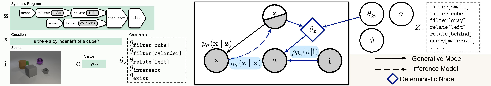

Probabilistic Neural-symbolic Models
====================================

Code for our ICML 2019 paper:

**[Probabilistic Neural-Symbolic Models for Interpretable Visual Question Answering][1]**  
Ramakrishna Vedantam, Karan Desai, Stefan Lee, Marcus Rohrbach, Dhruv Batra, Devi Parikh

  * [Setup and Dependencies](#setup-and-dependencies)
  * [Data Preprocessing](#data-preprocessing)
  * [Training](#training)
  * [Evaluation](#evaluation)
  * [Pretrained Checkpoint](#pretrained-checkpoint)

Checkout our package documentation at
[kdexd.github.io/probnmn-clevr](https://kdexd.github.io/probnmn-clevr)!



If you find this code useful, please consider citing:

```text
@inproceedings{vedantam2019probabilistic,
  title={Probabilistic Neural-symbolic Models for Interpretable Visual Question Answering},
  author={Ramakrishna Vedantam and Karan Desai and Stefan Lee and Marcus Rohrbach and Dhruv Batra and Devi Parikh},
  booktitle={ICML},
  year={2019}
}
```

Setup and Dependencies
----------------------

This codebase uses PyTorch v1.0 and provides out of the box support with CUDA 9 and CuDNN 7. The
recommended way to set up this codebase is throgh Anaconda / Miniconda, as a developement package:

1. Install Anaconda or Miniconda distribution based on Python3+ from their [downloads' site][2].
2. Clone this repository and create an environment:

```sh
git clone https://www.github.com/kdexd/probnmn-clevr
conda create -n probnmn python=3.6
```

3. Activate the environment and install all dependencies.

```sh
conda activate probnmn
cd probnmn-clevr/
pip install -r requirements.txt
```

4. Install this codebase as a package in development version.

```sh
python setup.py develop
```


Data Preprocessing
------------------

1. This codebase assumes all the data to be in `$PROJECT_ROOT/data` directory by default, although
   custom paths can be provided through config. Download CLEVR v1.0 dataset from [here][3] and
   symlink it as follows:

```text
$PROJECT_ROOT/data
    |—— CLEVR_test_questions.json
    |—— CLEVR_train_questions.json
    |—— CLEVR_val_questions.json
    `—— images
        |—— train
        |   |—— CLEVR_train_000000.png
        |   `—— CLEVR_train_000001.png ...
        |—— val
        |   |—— CLEVR_val_000000.png
        |   `—— CLEVR_val_000001.png ...
        `—— test
            |—— CLEVR_test_000000.png
            `—— CLEVR_test_000001.png ...
```

2. Build a vocabulary out of CLEVR programs, questions and answers, which can be read by AllenNLP,
   and will be used throughout the training and evaluation procedures. This will create a directory
   with separate text files containing unique tokens of questions, programs and answers.


```sh
python scripts/preprocess/build_vocabulary.py \
    --clevr-jsonpath data/CLEVR_train_questions.json \
    --output-dirpath data/clevr_vocabulary
```

3. Tokenize programs, questions and answers of CLEVR training, validation (and test) splits using
   this vocabulary mapping. This will create H5 files to be read by [`probnmn.data.readers`][6].

```sh
python scripts/preprocess/preprocess_questions.py \
    --clevr-jsonpath data/CLEVR_train_questions.json \
    --vocab-dirpath data/clevr_vocabulary \
    --output-h5path data/clevr_train_tokens.h5 \
    --split train
```

4. Extract image features using pre-trained ResNet-101 from torchvision model zoo.

```sh
python scripts/preprocess/extract_features.py \
    --image-dir data/images/train \
    --output-h5path data/clevr_train_features.h5 \
    --split train
```


Training
--------

Training a Probabilistic Neural-symbolic Model is done by first training a program prior on
all CLEVR v1.0 training split programs, followed by three sequential phases: `question_coding`,
`module_training` and `joint_training`. Configuration is managed through YAML files, with a
central package-wide configuration management system. Read more at [probnmn.config][5].

We have example config files for all phases, correspondng to both baseline NMN objective (from
[Johnson et. al. CVPR 2017][4]) and our Prob-NMN objective, under the [`configs`][7] directory.

Execute this command in order of phases: `program_prior`, `question_coding`, `module_training`
and `joint_training`. Symlink best checkpoints from previous phases in subsequent phases as
mentioned in config (or override those paths and provide custom paths).

```sh
python scripts/train.py \
    --config-yml configs/<name_of_config.yml> \
    --phase <phase_name> \
    --gpu-ids 0 \
    --serialization-dir checkpoints/<directory_name_to_save>
```

Evaluation
----------

Evaluation of a particular phase, given its saved checkpoint, can be done as follows:

```sh
python scripts/evaluate.py \
    --config-yml configs/<name_of_config.yml> \
    --phase <phase_name> \
    --checkpoint-path /path/to/phase_checkpoint.pth \
    --gpu-ids 0
```

Pretrained Checkpoint
---------------------

Coming soon, watch the repo for more updates!


[1]: https://arxiv.org/abs/1902.07864
[2]: https://conda.io/docs/user-guide/install/download.html
[3]: https://dl.fbaipublicfiles.com/clevr/CLEVR_v1.0.zip
[4]: https://www.github.com/facebookresearch/clevr-iep
[5]: https://kdexd.github.io/probnmn-clevr/probnmn/config.html
[6]: https://kdexd.github.io/probnmn-clevr/probnmn/data.readers.html
[7]: https://github.com/kdexd/probnmn-clevr/tree/master/configs
